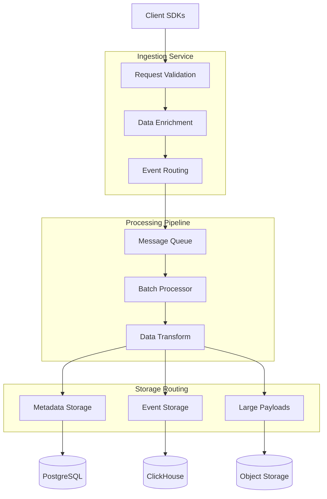
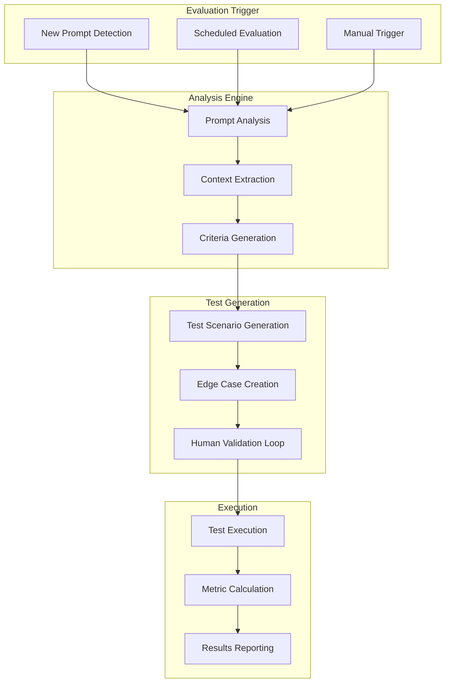
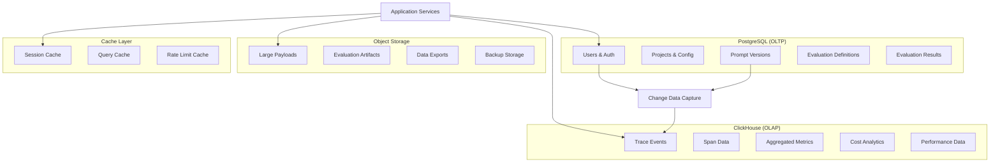
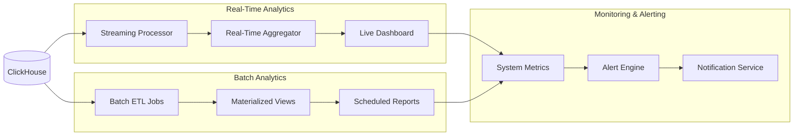
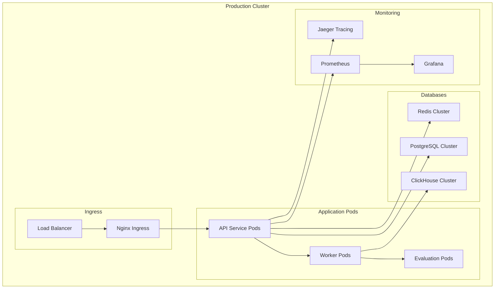

# EvalForge System Architecture

## High-Level Architecture Overview

```mermaid
graph TB
    %% Client Layer
    subgraph "Client Applications"
        APP1[LLM Application 1]
        APP2[LLM Application 2]
        APP3[Agent Workflows]
        SDK[EvalForge SDK]
    end

    %% API Gateway Layer
    subgraph "API Gateway & Load Balancing"
        ALB[Application Load Balancer]
        AUTH[Authentication Service]
        RATE[Rate Limiting]
    end

    %% Application Layer
    subgraph "Core Services (Go/Rust)"
        INGEST[Ingestion Service]
        EVAL[Auto-Evaluation Engine]
        ANALYTICS[Analytics Service]
        OPTIM[Optimization Service]
        SERVE[Agent Serving Service]
    end

    %% Processing Layer
    subgraph "Async Processing"
        QUEUE[Redis/Kafka Queue]
        TEMPORAL[Temporal Workflows]
        WORKER[Background Workers]
    end

    %% Storage Layer
    subgraph "Data Storage"
        PG[(PostgreSQL)]
        CH[(ClickHouse)]
        REDIS[(Redis Cache)]
        S3[(Object Storage)]
    end

    %% ML/AI Layer
    subgraph "AI/ML Services"
        EVALAI[Evaluation AI Service]
        PROMPTAI[Prompt Optimization AI]
        MODELS[LLM Provider APIs]
    end

    %% Frontend Layer
    subgraph "Frontend Applications"
        DASH[React Dashboard]
        API_DOCS[API Documentation]
        ADMIN[Admin Console]
    end

    %% External Integrations
    subgraph "External Services"
        OPENAI[OpenAI API]
        ANTHROPIC[Anthropic API]
        PROVIDERS[Other LLM Providers]
        ALERTS[Alerting (PagerDuty/Slack)]
    end

    %% Connections
    APP1 --> SDK
    APP2 --> SDK
    APP3 --> SDK
    SDK --> ALB
    
    ALB --> AUTH
    ALB --> RATE
    AUTH --> INGEST
    RATE --> INGEST
    
    INGEST --> QUEUE
    QUEUE --> WORKER
    WORKER --> EVAL
    WORKER --> ANALYTICS
    WORKER --> OPTIM
    
    EVAL --> EVALAI
    OPTIM --> PROMPTAI
    SERVE --> MODELS
    
    INGEST --> PG
    INGEST --> CH
    ANALYTICS --> CH
    EVAL --> PG
    OPTIM --> PG
    
    WORKER --> TEMPORAL
    TEMPORAL --> REDIS
    
    EVALAI --> OPENAI
    PROMPTAI --> ANTHROPIC
    MODELS --> PROVIDERS
    
    DASH --> ALB
    API_DOCS --> ALB
    ADMIN --> ALB
    
    ANALYTICS --> ALERTS
    
    %% Large files/payloads
    INGEST --> S3
    DASH --> S3

    %% Styling
    classDef client fill:#e1f5fe
    classDef api fill:#f3e5f5
    classDef core fill:#e8f5e8
    classDef storage fill:#fff3e0
    classDef ml fill:#fce4ec
    classDef frontend fill:#e0f2f1
    classDef external fill:#f5f5f5

    class APP1,APP2,APP3,SDK client
    class ALB,AUTH,RATE api
    class INGEST,EVAL,ANALYTICS,OPTIM,SERVE core
    class PG,CH,REDIS,S3 storage
    class EVALAI,PROMPTAI,MODELS ml
    class DASH,API_DOCS,ADMIN frontend
    class OPENAI,ANTHROPIC,PROVIDERS,ALERTS external
```

## Detailed Component Architecture

### 1. Client Integration Layer

```mermaid
graph LR
    subgraph "EvalForge SDK"
        WRAPPER[LLM API Wrappers]
        TRACER[Tracing Logic]
        BUFFER[Local Buffer]
        RETRY[Retry Logic]
    end
    
    subgraph "User Application"
        CODE[User Code]
        OPENAI_CALL[OpenAI.chat()]
        ANTHROPIC_CALL[Anthropic.messages()]
    end
    
    CODE --> WRAPPER
    WRAPPER --> OPENAI_CALL
    WRAPPER --> ANTHROPIC_CALL
    WRAPPER --> TRACER
    TRACER --> BUFFER
    BUFFER --> RETRY
    RETRY --> API[EvalForge API]
```

**Key Features:**
- One-line integration with popular LLM providers
- Automatic context propagation and span creation
- Local buffering with async batch uploads
- Retry logic with exponential backoff
- Zero-impact performance (async everything)

### 2. Data Ingestion Pipeline



**Performance Specifications:**
- Handle 50,000+ events/second burst capacity
- Sub-100ms P95 ingestion latency
- 99.99% data durability guarantee
- Automatic payload size optimization

### 3. Auto-Evaluation Engine



**AI Evaluation Capabilities:**
- Automatic evaluation criteria detection (accuracy, safety, tone, relevance)
- Synthetic test case generation with edge cases
- Multi-modal evaluation (text, images, structured data)
- Human-in-the-loop validation and approval
- Continuous learning from evaluation results

### 4. Data Storage Architecture



**Storage Specifications:**
- **PostgreSQL**: 99.95% availability, automated backups, read replicas
- **ClickHouse**: 16x compression ratio, sub-second queries on billions of rows
- **Object Storage**: 99.999999999% durability, global CDN distribution
- **Redis**: <1ms latency, automatic failover, cluster mode

### 5. Analytics & Monitoring



**Analytics Features:**
- Real-time cost tracking and budget alerts
- P50/P90/P95/P99 latency percentiles
- Error rate monitoring with automatic anomaly detection
- User session reconstruction and funnel analysis
- Comparative A/B testing with statistical significance

## Infrastructure & Deployment

### Kubernetes Architecture



### Deployment Strategy

**Multi-Region Setup:**
- Primary: US-East (Virginia)
- Secondary: US-West (Oregon)  
- DR: EU-West (Ireland)

**Scaling Configuration:**
- Auto-scaling based on CPU/Memory/Queue depth
- Horizontal Pod Autoscaler (HPA) with custom metrics
- Cluster autoscaling for node management
- Database read replicas in each region

**Security & Compliance:**
- End-to-end encryption (TLS 1.3)
- Network policies and service mesh (Istio)
- Secret management with HashiCorp Vault
- SOC2 Type II compliance ready
- GDPR compliance with data residency options

## Technology Stack Summary

| Component | Technology | Justification |
|-----------|------------|---------------|
| **Backend Services** | Go | Performance, concurrency, mature ecosystem |
| **Performance Critical** | Rust | Maximum performance for data processing |
| **Frontend** | React + TypeScript | Developer productivity, ecosystem |
| **OLTP Database** | PostgreSQL 15+ | ACID compliance, JSON support, extensions |
| **OLAP Database** | ClickHouse | Columnar storage, compression, query speed |
| **Cache** | Redis | Sub-millisecond latency, pub/sub |
| **Message Queue** | Redis Streams / Kafka | Event streaming, ordering guarantees |
| **Workflow Engine** | Temporal | Durable execution, complex workflows |
| **Container Orchestration** | Kubernetes | Industry standard, multi-cloud |
| **Monitoring** | Prometheus + Grafana | Open source, customizable |
| **Tracing** | OpenTelemetry + Jaeger | Vendor neutral, distributed tracing |
| **Object Storage** | S3-compatible | Scalability, durability, cost-effective |

This architecture provides a solid foundation for scaling to millions of events while maintaining sub-second query performance and enterprise-grade reliability.