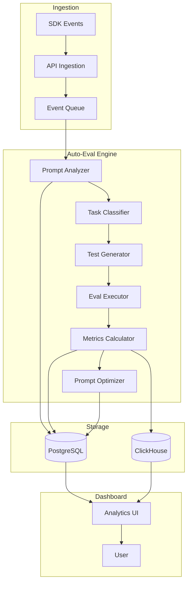

# Auto-Evaluation Implementation Plan

## Overview

The auto-evaluation system is the core differentiator for EvalForge. It automatically analyzes prompts, generates test cases, calculates metrics (accuracy, F1, precision, recall), and suggests prompt improvements.

## Architecture



## Component Details

### 1. Prompt Analyzer (`backend/evaluation/analyzer.go`)

```go
package evaluation

import (
    "encoding/json"
    "github.com/google/uuid"
)

type PromptAnalyzer struct {
    llmClient LLMClient
}

type PromptAnalysis struct {
    ID           uuid.UUID
    PromptID     uuid.UUID
    TaskType     TaskType      // classification, generation, extraction, etc.
    InputSchema  InputSchema   // Expected input format
    OutputSchema OutputSchema  // Expected output format
    Constraints  []Constraint  // Rules the output should follow
    Examples     []Example     // Few-shot examples if present
}

type TaskType string

const (
    TaskClassification TaskType = "classification"
    TaskGeneration     TaskType = "generation"
    TaskExtraction     TaskType = "extraction"
    TaskSummarization  TaskType = "summarization"
    TaskQA             TaskType = "question_answering"
)

func (pa *PromptAnalyzer) AnalyzePrompt(prompt string, examples []Example) (*PromptAnalysis, error) {
    // Use LLM to analyze prompt structure
    analysisPrompt := fmt.Sprintf(`
Analyze this prompt and determine:
1. Task type (classification/generation/extraction/etc)
2. Expected input format
3. Expected output format
4. Any constraints or rules
5. Evaluation criteria

Prompt: %s

Examples: %v

Return as JSON.
`, prompt, examples)

    response, err := pa.llmClient.Complete(analysisPrompt)
    if err != nil {
        return nil, err
    }

    var analysis PromptAnalysis
    if err := json.Unmarshal([]byte(response), &analysis); err != nil {
        return nil, err
    }

    return &analysis, nil
}
```

### 2. Test Case Generator (`backend/evaluation/generator.go`)

```go
package evaluation

type TestGenerator struct {
    llmClient LLMClient
}

type TestCase struct {
    ID           uuid.UUID
    Name         string
    Input        map[string]interface{}
    ExpectedOutput map[string]interface{}
    Category     string // edge_case, normal, adversarial
    Weight       float64
}

func (tg *TestGenerator) GenerateTestCases(analysis *PromptAnalysis) ([]TestCase, error) {
    testCases := []TestCase{}
    
    // Generate different categories of test cases
    categories := []struct{
        name string
        count int
        prompt string
    }{
        {
            name: "normal",
            count: 20,
            prompt: "Generate typical test cases",
        },
        {
            name: "edge_case", 
            count: 10,
            prompt: "Generate edge cases and boundary conditions",
        },
        {
            name: "adversarial",
            count: 5,
            prompt: "Generate adversarial or tricky test cases",
        },
    }
    
    for _, cat := range categories {
        cases, err := tg.generateCategory(analysis, cat.name, cat.count, cat.prompt)
        if err != nil {
            return nil, err
        }
        testCases = append(testCases, cases...)
    }
    
    return testCases, nil
}

func (tg *TestGenerator) generateCategory(analysis *PromptAnalysis, category string, count int, instruction string) ([]TestCase, error) {
    prompt := fmt.Sprintf(`
Based on this prompt analysis, generate %d test cases for %s:

Task Type: %s
Input Schema: %v
Output Schema: %v
Constraints: %v

%s

Return as JSON array of test cases with input and expected output.
`, count, category, analysis.TaskType, analysis.InputSchema, analysis.OutputSchema, analysis.Constraints, instruction)

    response, err := tg.llmClient.Complete(prompt)
    if err != nil {
        return nil, err
    }
    
    var testCases []TestCase
    if err := json.Unmarshal([]byte(response), &testCases); err != nil {
        return nil, err
    }
    
    // Set category and generate IDs
    for i := range testCases {
        testCases[i].ID = uuid.New()
        testCases[i].Category = category
    }
    
    return testCases, nil
}
```

### 3. Metrics Calculator (`backend/evaluation/metrics.go`)

```go
package evaluation

import (
    "math"
)

type MetricsCalculator struct{}

type ClassificationMetrics struct {
    Accuracy  float64
    Precision map[string]float64 // Per-class precision
    Recall    map[string]float64 // Per-class recall
    F1Score   map[string]float64 // Per-class F1
    MacroF1   float64
    WeightedF1 float64
    ConfusionMatrix map[string]map[string]int
}

func (mc *MetricsCalculator) CalculateClassificationMetrics(predictions, groundTruth []string, classes []string) *ClassificationMetrics {
    metrics := &ClassificationMetrics{
        Precision: make(map[string]float64),
        Recall:    make(map[string]float64),
        F1Score:   make(map[string]float64),
        ConfusionMatrix: make(map[string]map[string]int),
    }
    
    // Initialize confusion matrix
    for _, class := range classes {
        metrics.ConfusionMatrix[class] = make(map[string]int)
    }
    
    // Build confusion matrix
    correct := 0
    for i := range predictions {
        pred := predictions[i]
        truth := groundTruth[i]
        metrics.ConfusionMatrix[truth][pred]++
        if pred == truth {
            correct++
        }
    }
    
    // Calculate accuracy
    metrics.Accuracy = float64(correct) / float64(len(predictions))
    
    // Calculate per-class metrics
    for _, class := range classes {
        tp := metrics.ConfusionMatrix[class][class]
        fp := 0
        fn := 0
        
        for _, otherClass := range classes {
            if otherClass != class {
                fp += metrics.ConfusionMatrix[otherClass][class]
                fn += metrics.ConfusionMatrix[class][otherClass]
            }
        }
        
        // Precision
        if tp + fp > 0 {
            metrics.Precision[class] = float64(tp) / float64(tp + fp)
        }
        
        // Recall
        if tp + fn > 0 {
            metrics.Recall[class] = float64(tp) / float64(tp + fn)
        }
        
        // F1 Score
        if metrics.Precision[class] + metrics.Recall[class] > 0 {
            metrics.F1Score[class] = 2 * metrics.Precision[class] * metrics.Recall[class] / 
                                   (metrics.Precision[class] + metrics.Recall[class])
        }
    }
    
    // Calculate macro and weighted F1
    metrics.MacroF1 = mc.calculateMacroF1(metrics.F1Score)
    metrics.WeightedF1 = mc.calculateWeightedF1(metrics.F1Score, metrics.ConfusionMatrix)
    
    return metrics
}

func (mc *MetricsCalculator) calculateMacroF1(f1Scores map[string]float64) float64 {
    sum := 0.0
    for _, f1 := range f1Scores {
        sum += f1
    }
    return sum / float64(len(f1Scores))
}
```

### 4. Prompt Optimizer (`backend/evaluation/optimizer.go`)

```go
package evaluation

type PromptOptimizer struct {
    llmClient LLMClient
}

type OptimizationSuggestion struct {
    ID          uuid.UUID
    Type        string // clarity, specificity, examples, format, constraints
    Description string
    OldPrompt   string
    NewPrompt   string
    Impact      float64 // Expected improvement
}

func (po *PromptOptimizer) SuggestImprovements(
    prompt string, 
    metrics *ClassificationMetrics,
    errorAnalysis *ErrorAnalysis,
) ([]OptimizationSuggestion, error) {
    
    suggestions := []OptimizationSuggestion{}
    
    // Analyze errors and suggest improvements
    if metrics.Accuracy < 0.8 {
        // Low accuracy - suggest clarity improvements
        suggestion, err := po.improveClarify(prompt, errorAnalysis)
        if err == nil && suggestion != nil {
            suggestions = append(suggestions, *suggestion)
        }
    }
    
    if errorAnalysis.AmbiguousCases > 0.1 {
        // High ambiguity - suggest adding constraints
        suggestion, err := po.addConstraints(prompt, errorAnalysis)
        if err == nil && suggestion != nil {
            suggestions = append(suggestions, *suggestion)
        }
    }
    
    if errorAnalysis.FormatErrors > 0.05 {
        // Format issues - suggest format specifications
        suggestion, err := po.improveFormat(prompt, errorAnalysis)
        if err == nil && suggestion != nil {
            suggestions = append(suggestions, *suggestion)
        }
    }
    
    // Suggest adding few-shot examples if none present
    if !containsExamples(prompt) && metrics.Accuracy < 0.9 {
        suggestion, err := po.addExamples(prompt, errorAnalysis)
        if err == nil && suggestion != nil {
            suggestions = append(suggestions, *suggestion)
        }
    }
    
    return suggestions, nil
}

func (po *PromptOptimizer) improveClarify(prompt string, errors *ErrorAnalysis) (*OptimizationSuggestion, error) {
    optimizationPrompt := fmt.Sprintf(`
The following prompt has accuracy issues (common errors: %v).
Suggest a clearer version that reduces ambiguity:

Original prompt:
%s

Provide:
1. Specific issues with clarity
2. Improved prompt
3. Why this should improve accuracy
`, errors.CommonErrors, prompt)

    response, err := po.llmClient.Complete(optimizationPrompt)
    if err != nil {
        return nil, err
    }
    
    // Parse response and create suggestion
    return &OptimizationSuggestion{
        ID:          uuid.New(),
        Type:        "clarity",
        Description: "Improve prompt clarity to reduce ambiguity",
        OldPrompt:   prompt,
        NewPrompt:   parseNewPrompt(response),
        Impact:      0.15, // Expected 15% improvement
    }, nil
}
```

### 5. Dashboard Integration (`frontend/src/pages/Evaluations.tsx`)

```typescript
import React, { useState, useEffect } from 'react';
import { useQuery } from '@tanstack/react-query';
import { LineChart, BarChart, ConfusionMatrix } from '../components/charts';

interface EvaluationMetrics {
  accuracy: number;
  f1Score: number;
  precision: number;
  recall: number;
  confusionMatrix: Record<string, Record<string, number>>;
}

interface PromptSuggestion {
  id: string;
  type: string;
  description: string;
  oldPrompt: string;
  newPrompt: string;
  expectedImpact: number;
}

export const EvaluationsPage: React.FC = () => {
  const [selectedProject, setSelectedProject] = useState<string>('');
  const [selectedPrompt, setSelectedPrompt] = useState<string>('');

  // Fetch evaluations
  const { data: evaluations } = useQuery({
    queryKey: ['evaluations', selectedProject],
    queryFn: () => fetchEvaluations(selectedProject),
  });

  // Fetch metrics for selected evaluation
  const { data: metrics } = useQuery({
    queryKey: ['metrics', selectedPrompt],
    queryFn: () => fetchMetrics(selectedPrompt),
    enabled: !!selectedPrompt,
  });

  // Fetch optimization suggestions
  const { data: suggestions } = useQuery({
    queryKey: ['suggestions', selectedPrompt],
    queryFn: () => fetchSuggestions(selectedPrompt),
    enabled: !!selectedPrompt,
  });

  return (
    <div className="p-6">
      <h1 className="text-2xl font-bold mb-6">Evaluations & Optimization</h1>
      
      {/* Metrics Overview */}
      <div className="grid grid-cols-4 gap-4 mb-8">
        <MetricCard title="Accuracy" value={metrics?.accuracy} format="percentage" />
        <MetricCard title="F1 Score" value={metrics?.f1Score} format="percentage" />
        <MetricCard title="Precision" value={metrics?.precision} format="percentage" />
        <MetricCard title="Recall" value={metrics?.recall} format="percentage" />
      </div>

      {/* Confusion Matrix */}
      {metrics?.confusionMatrix && (
        <div className="mb-8">
          <h2 className="text-xl font-semibold mb-4">Confusion Matrix</h2>
          <ConfusionMatrix data={metrics.confusionMatrix} />
        </div>
      )}

      {/* Optimization Suggestions */}
      {suggestions && suggestions.length > 0 && (
        <div className="mb-8">
          <h2 className="text-xl font-semibold mb-4">Prompt Optimization Suggestions</h2>
          <div className="space-y-4">
            {suggestions.map((suggestion) => (
              <SuggestionCard
                key={suggestion.id}
                suggestion={suggestion}
                onApply={() => applySuggestion(suggestion.id)}
              />
            ))}
          </div>
        </div>
      )}

      {/* A/B Test Results */}
      <div className="mb-8">
        <h2 className="text-xl font-semibold mb-4">A/B Test Performance</h2>
        <ABTestChart promptId={selectedPrompt} />
      </div>
    </div>
  );
};
```

## Implementation Timeline

### Week 1: Core Auto-Eval Engine
- [ ] Day 1-2: Implement Prompt Analyzer
- [ ] Day 3-4: Build Test Case Generator
- [ ] Day 5: Integration testing

### Week 2: Metrics & Optimization
- [ ] Day 1-2: Implement Metrics Calculator
- [ ] Day 3-4: Build Prompt Optimizer
- [ ] Day 5: Dashboard integration

### Week 3: Testing & Refinement
- [ ] Day 1-2: End-to-end testing
- [ ] Day 3-4: Performance optimization
- [ ] Day 5: Documentation

## Testing Strategy

### Unit Tests
```go
func TestPromptAnalyzer(t *testing.T) {
    analyzer := &PromptAnalyzer{llmClient: mockLLMClient}
    
    testCases := []struct{
        name   string
        prompt string
        expectedType TaskType
    }{
        {
            name: "Classification prompt",
            prompt: "Classify the sentiment as positive, negative, or neutral",
            expectedType: TaskClassification,
        },
        {
            name: "Generation prompt",
            prompt: "Write a summary of the following article",
            expectedType: TaskGeneration,
        },
    }
    
    for _, tc := range testCases {
        t.Run(tc.name, func(t *testing.T) {
            analysis, err := analyzer.AnalyzePrompt(tc.prompt, nil)
            assert.NoError(t, err)
            assert.Equal(t, tc.expectedType, analysis.TaskType)
        })
    }
}
```

### Integration Tests
```python
def test_end_to_end_evaluation():
    # Track an agent execution
    with ef.trace("sentiment_analysis") as trace:
        trace.log_input({"text": "Great product!"})
        trace.log_output({"sentiment": "positive"})
    
    # Wait for auto-eval to trigger
    time.sleep(5)
    
    # Check evaluation was created
    eval = ef.get_evaluation(trace.id)
    assert eval is not None
    assert len(eval.test_cases) >= 30
    
    # Check metrics were calculated
    metrics = eval.get_metrics()
    assert metrics.accuracy is not None
    assert metrics.f1_score is not None
    
    # Check suggestions were generated
    suggestions = eval.get_suggestions()
    assert len(suggestions) > 0
```

## Success Metrics

1. **Auto-eval trigger rate**: >90% of eligible prompts
2. **Test case quality**: >80% valid test cases
3. **Metrics accuracy**: Within 5% of manual evaluation
4. **Suggestion acceptance**: >40% of suggestions applied
5. **Performance improvement**: >10% average after optimization

This implementation will complete the core differentiator for EvalForge, enabling automatic evaluation creation with comprehensive metrics and actionable optimization suggestions.