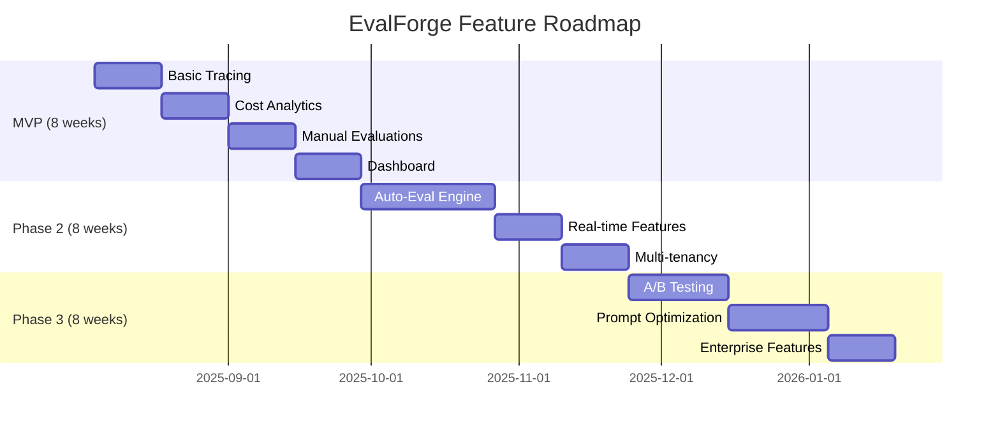

# EvalForge Refined Product Strategy
*Balancing Ambition with Pragmatism*

## Executive Summary

After analyzing the current PRD and technical architecture, this refined strategy ruthlessly prioritizes features for rapid market validation while building defensible moats. The approach focuses on getting to market in 8 weeks with a laser-focused MVP that delivers clear value to mid-market AI companies.

**Key Strategic Shifts:**
- Reduce MVP scope by 60% to focus on core value proposition
- Target narrow customer segment initially for faster product-market fit
- Build manual/semi-automated features first, automate based on validated demand
- Design pricing to optimize for quick adoption and feedback loops

---

## 1. MVP Feature Prioritization

### Core Value Hypothesis
**"Mid-market AI companies need dead-simple observability that shows ROI within 15 minutes of setup"**

### Ruthless MVP Feature Cut (Phase 1 - 8 weeks)

#### KEEP: Essential Features (60% effort reduction)
```yaml
observability_core:
  - Real-time tracing (OpenAI + Anthropic only)
  - Cost tracking with simple alerts
  - Basic performance metrics (latency, error rate)
  - One-line SDK integration

manual_evaluation:
  - Template-based evaluation creation (not AI-generated)
  - Manual test case upload (CSV/JSON)
  - Simple pass/fail scoring
  - Side-by-side prompt comparison

dashboard:
  - Single project view (no multi-tenancy yet)
  - 4 key metrics: cost, latency, errors, volume
  - 24-hour data retention (not real-time)
  - CSV export only
```

#### CUT: Automate Later (Post-MVP)
```yaml
deferred_features:
  - Auto-evaluation generation (biggest differentiator, but complex)
  - Multi-modal support (focus on text only)
  - Advanced analytics (anomaly detection, predictions)
  - Session reconstruction
  - Multi-project support
  - Real-time dashboards
  - A/B testing framework
```

#### MANUAL: Semi-Automated Workarounds
```yaml
manual_processes:
  evaluation_creation:
    - Provide evaluation templates for common use cases
    - Manual consultation for custom evaluations
    - Build evaluation library from customer requests
    
  prompt_optimization:
    - Manual analysis and suggestions
    - Weekly optimization reports
    - Professional services for enterprise customers
    
  onboarding:
    - White-glove setup for first 50 customers
    - Manual dashboard configuration
    - Personal walkthrough sessions
```

### Feature Roadmap Timeline


---

## 2. Go-to-Market Strategy Refinement

### Ideal Customer Profile (ICP) - Laser Focus

#### Primary Target: Series A-B AI Companies
```yaml
company_profile:
  size: 20-100 engineers
  funding_stage: Series A-B ($5M-$50M raised)
  llm_usage: 100K-5M requests/month
  current_pain: Using multiple tools, manual evaluation, no cost visibility
  
  specific_roles:
    primary_buyer: VP Engineering / CTO
    primary_user: Senior Engineers, DevOps
    economic_buyer: CEO/CFO (cost visibility angle)

vertical_focus:
  1. Customer support automation (chatbots, ticket routing)
  2. Content generation platforms (marketing, social media)
  3. Developer tools (code generation, documentation)
  4. Enterprise search and knowledge management
```

#### Why This ICP Works
- **Budget**: Can afford $500-5K/month tools
- **Pain**: Acute enough to switch from free/basic tools
- **Decision Speed**: Faster than enterprise, more budget than startups
- **Reference Value**: Other companies will follow their lead

### Competitive Positioning

#### Positioning Statement
*"The only observability platform that shows LLM ROI from day one, not month twelve"*

#### Differentiation Matrix
| Competitor | Strength | Our Advantage |
|------------|----------|---------------|
| **LangSmith** | LangChain ecosystem | Provider-agnostic, better cost analytics |
| **Helicone** | Simple proxy setup | More comprehensive metrics, evaluation focus |
| **Braintrust** | Evaluation focus | Better observability integration, faster setup |
| **DataDog** | Enterprise features | LLM-specific, 10x cheaper, faster time-to-value |

#### Messaging Framework
```yaml
primary_message: "See LLM ROI in 15 minutes, not 15 weeks"

supporting_messages:
  cost_visibility: "Know exactly what each prompt costs before your bill arrives"
  evaluation_focus: "Test prompts like you test code - systematically and automatically"
  unified_platform: "One dashboard for observability, evaluation, and optimization"
  
pain_points_addressed:
  - "Our LLM costs went from $500 to $5000/month and nobody knows why"
  - "We're flying blind - no idea if our prompts are actually working"
  - "Managing 5 different tools just to monitor our AI features"
```

### Pricing Strategy

#### Freemium Model Design
```yaml
free_tier:
  events: 10K/month
  data_retention: 7 days
  features: Basic tracing, cost tracking
  limitation: Single project, no evaluations
  
startup_tier: # $49/month
  events: 100K/month  
  data_retention: 30 days
  features: All observability, manual evaluations
  support: Community
  
growth_tier: # $249/month
  events: 1M/month
  data_retention: 90 days  
  features: Auto-evaluations, basic optimization
  support: Email, Slack connect
  
enterprise_tier: # $999/month
  events: 10M/month
  data_retention: 1 year
  features: Everything + SSO, RBAC
  support: Dedicated success manager
```

#### Pricing Psychology
- **$49 price point**: Below expense approval threshold
- **10x event progression**: Clear upgrade path
- **Feature gating**: Free tier drives evaluation adoption
- **Support differentiation**: Service as competitive moat

### Developer-First Adoption Strategy

#### Phase 1: Developer Love (Weeks 1-8)
```yaml
tactics:
  content_marketing:
    - "LLM Cost Optimization" weekly newsletter
    - Technical deep-dives on prompt engineering ROI
    - Open-source cost calculation tools
    
  community_building:
    - Discord server for LLM practitioners
    - Monthly "Prompt Performance" meetups
    - Conference speaking (AI conferences, not DevOps)
    
  product_led_growth:
    - GitHub Actions integration for CI/CD evaluation
    - VS Code extension for prompt testing
    - CLI tool for local development
```

#### Phase 2: Commercial Conversion (Weeks 9-16)
```yaml
tactics:
  enterprise_outreach:
    - Target VP Eng at Series A-B companies
    - ROI-focused demos (cost savings calculator)
    - Free optimization audit for enterprise prospects
    
  partner_ecosystem:
    - LangChain integration partnership
    - OpenAI/Anthropic partner directory listing
    - AI consulting firm referral program
    
  customer_success:
    - Weekly usage reports with optimization suggestions
    - Quarterly business reviews with ROI calculations
    - Success story case studies and webinars
```

---

## 3. User Journey Mapping

### Complete User Journey: Discovery to Value Realization

#### Stage 1: Discovery (0-1 day)
```yaml
touchpoints:
  - Newsletter signup (LLM cost optimization content)
  - GitHub repo discovery (open-source tools)
  - Conference talk or blog post
  - Peer recommendation
  
friction_points:
  - Too many observability options (analysis paralysis)
  - Unclear differentiation from DataDog/New Relic
  
optimization:
  - Clear 15-minute time-to-value promise
  - Interactive cost calculator on homepage
  - Customer ROI case studies prominently featured
```

#### Stage 2: Trial Signup (Day 1)
```yaml
current_flow:
  1. Email signup
  2. Account creation
  3. Project setup
  4. SDK installation
  5. First data points
  
optimized_flow:
  1. GitHub/Google OAuth (reduce friction)
  2. Auto-detect popular frameworks during setup
  3. Pre-populated SDK snippets for detected stack
  4. Test data injection for immediate dashboard population
  5. Guided "aha moment" tour
  
success_metrics:
  - Signup to first event: <10 minutes (currently 30+ minutes)
  - SDK integration time: <5 minutes
  - Time to first insights: <15 minutes
```

#### Stage 3: Onboarding (Days 1-7)
```yaml
critical_actions:
  day_1: First LLM call traced successfully
  day_2: Cost alert configured
  day_3: First evaluation created
  day_7: Week-over-week comparison viewed
  
engagement_sequence:
  day_1_email: "Your first $X in LLM costs tracked"
  day_3_email: "3 optimization opportunities found"
  day_7_email: "Your weekly LLM performance report"
  
friction_points:
  - SDK configuration complexity
  - Evaluation creation learning curve
  - Dashboard information overload
  
solutions:
  - One-line integration examples for top 5 frameworks
  - Evaluation templates library
  - Progressive disclosure in dashboard UI
```

#### Stage 4: Value Realization (Days 7-30)
```yaml
value_moments:
  immediate: Real-time cost visibility
  week_1: First prompt performance insights
  week_2: Cost optimization recommendation
  week_4: Demonstrable ROI from optimization
  
customer_success_triggers:
  - Usage drops below threshold → proactive outreach
  - High cost anomaly detected → optimization consultation
  - Positive ROI achieved → case study request
  - Multiple team members added → expansion conversation
```

#### Stage 5: Expansion (Days 30-90)
```yaml
expansion_triggers:
  usage_based: Approaching plan limits
  feature_based: Requesting advanced evaluations
  team_based: Multiple projects or team members
  
expansion_tactics:
  - Automatic usage alerts with upgrade prompts
  - Feature gated experiences with upgrade CTAs
  - ROI-based expansion conversations
  - Free trial of higher tier features
```

### Success Metrics by Stage
```yaml
discovery_metrics:
  website_visits: 10K/month by week 8
  content_engagement: 15% email open rate
  
trial_metrics:
  signup_conversion: 8% (website visitors to trial)
  time_to_first_event: <10 minutes
  
onboarding_metrics:
  day_7_retention: 40%
  day_30_retention: 25%
  feature_adoption: 60% create evaluation within 7 days
  
expansion_metrics:
  free_to_paid_conversion: 15%
  expansion_revenue: 130% net revenue retention
  time_to_upgrade: <45 days
```

---

## 4. Competitive Differentiation

### Deep Competitive Analysis

#### Current Landscape Weaknesses
```yaml
langsmith:
  strengths: LangChain integration, evaluation focus
  weaknesses:
    - Expensive for small teams ($99+ minimum)
    - Complex setup for non-LangChain users
    - Limited cost analytics
    - Focused on development, not production
  
helicone:
  strengths: Simple proxy setup, good pricing
  weaknesses:
    - Basic evaluation features
    - Limited analytics depth
    - No optimization features
    - Primarily observability, not insights
    
braintrust:
  strengths: Strong evaluation platform
  weaknesses:
    - Weak observability features
    - Expensive for continuous monitoring
    - Enterprise-focused (high minimum)
    - Complex for simple use cases
```

#### Our Defensible Advantages

##### 1. ROI-First Approach
```yaml
differentiation:
  - First platform to show LLM ROI, not just metrics
  - Cost optimization recommendations based on actual usage
  - Business impact tracking (conversion rates, user satisfaction)
  - CFO-friendly reporting with clear cost attribution
  
defensibility:
  - Data network effects (more usage data = better recommendations)
  - Switching costs increase as optimization history grows
  - Integration depth makes replacement painful
```

##### 2. Unified Developer Experience
```yaml
differentiation:
  - Single SDK for observability + evaluation + optimization
  - Zero-config setup for popular frameworks
  - Development-to-production continuity
  - Built-in CI/CD integration
  
defensibility:
  - Developer workflow lock-in
  - Custom integrations and configurations
  - Organizational knowledge and processes
```

##### 3. Prompt-to-Production Optimization Loop
```yaml
differentiation:
  - Only platform connecting evaluation results to production optimization
  - Automated A/B testing based on evaluation insights
  - Continuous improvement recommendations
  - Rollback capabilities based on performance degradation
  
defensibility:
  - Proprietary optimization algorithms
  - Customer data flywheel
  - Process integration depth
```

### Competitive Response Strategy

#### When LangSmith Adds Cost Analytics (Likely)
```yaml
response:
  - Emphasize provider-agnostic approach
  - Focus on SMB-friendly pricing
  - Highlight superior optimization features
  - Launch "Migration from LangSmith" program
  
timeline: Expect in 6-9 months
preparation:
  - Patent optimization algorithm innovations
  - Build customer case studies highlighting cost savings
  - Deepen integrations beyond LangChain ecosystem
```

#### When Observability Giants Enter (DataDog, New Relic)
```yaml
response:
  - Focus on LLM-specific features and expertise
  - Emphasize speed and simplicity vs. enterprise complexity
  - Build strong community and developer relationships
  - Consider acquisition or partnership strategies
  
timeline: 12-18 months
preparation:
  - Build defendable IP around evaluation automation
  - Create strong brand in LLM community
  - Establish enterprise customer relationships
```

### Partnership Strategy

#### Technology Partnerships
```yaml
tier_1_integrations: # Revenue-impacting
  - OpenAI official partnership (marketplace listing)
  - Anthropic integration certification
  - LangChain ecosystem partnership
  
tier_2_integrations: # Adoption-driving
  - Vercel/Netlify deployment integrations
  - GitHub Actions marketplace presence
  - AWS/Azure partner directory listing
  
tier_3_integrations: # Feature-completing
  - Slack/Discord notification integrations
  - PagerDuty/DataDog alerting
  - Jupyter notebook integration
```

#### Go-to-Market Partnerships
```yaml
consulting_partnerships:
  - AI consulting firms (revenue sharing)
  - System integrators (referral program)
  - Training companies (content collaboration)
  
channel_partnerships:
  - Cloud provider marketplaces
  - AI conference sponsor relationships
  - Developer community partnerships
```

---

## 5. Business Model Validation

### Pricing Assumptions Analysis

#### Market Research Validation
```yaml
current_spending_analysis:
  observability_budget: $2K-10K/month (mid-market)
  llm_infrastructure: $5K-50K/month
  evaluation_manual_cost: $5K-20K/month (engineer time)
  
willingness_to_pay:
  cost_savings_roi: Will pay 10-20% of monthly LLM costs
  time_savings_roi: Will pay $50-100/hour of engineer time saved
  risk_mitigation: Will pay 5-10% of potential downtime costs
  
competitive_pricing:
  langsmith: $99-499/month
  braintrust: $200-2000/month  
  helicone: $20-200/month
  datadog: $15-100/user/month
```

#### Pricing Validation Experiments

##### Experiment 1: Price Sensitivity Testing
```yaml
methodology:
  - A/B test pricing tiers during signup
  - Track conversion rates at different price points
  - Survey willingness to pay for specific features
  
hypothesis: Mid-market will pay $200-500/month for unified platform
validation_criteria: >15% conversion at $249/month price point
timeline: Weeks 4-8 of MVP launch
```

##### Experiment 2: Value-Based Pricing
```yaml
methodology:
  - Offer "percentage of savings" pricing model
  - Track customer LTV vs. acquisition cost
  - Compare with fixed-price model performance
  
hypothesis: Customers prefer predictable fixed pricing
validation_criteria: <20% churn rate on fixed pricing
timeline: Weeks 8-16 after launch
```

##### Experiment 3: Freemium Conversion
```yaml
methodology:
  - Track free-to-paid conversion rates
  - Test different limitation strategies
  - Measure feature adoption that drives upgrades
  
hypothesis: Evaluation features drive conversions more than limits
validation_criteria: >12% free-to-paid conversion rate
timeline: Continuous after launch
```

### Financial Projections

#### Conservative Scenario (Base Case)
```yaml
month_6_targets:
  customers: 25 paying
  arr: $75K
  average_deal_size: $3K annually
  churn_rate: 8% monthly
  
month_12_targets:
  customers: 75 paying
  arr: $300K
  average_deal_size: $4K annually
  churn_rate: 5% monthly
  
assumptions:
  - 15% free-to-paid conversion
  - 25% month-over-month growth
  - 120% net revenue retention
```

#### Optimistic Scenario (Success Case)
```yaml
month_6_targets:
  customers: 50 paying
  arr: $200K
  average_deal_size: $4K annually
  churn_rate: 5% monthly
  
month_12_targets:
  customers: 200 paying
  arr: $1M annually
  average_deal_size: $5K annually
  churn_rate: 3% monthly
  
assumptions:
  - 25% free-to-paid conversion
  - 40% month-over-month growth
  - 150% net revenue retention
```

#### Pessimistic Scenario (Survive Case)
```yaml
month_6_targets:
  customers: 10 paying
  arr: $25K
  average_deal_size: $2.5K annually
  churn_rate: 12% monthly
  
month_12_targets:
  customers: 30 paying
  arr: $100K
  average_deal_size: $3.3K annually
  churn_rate: 8% monthly
  
assumptions:
  - 8% free-to-paid conversion
  - 15% month-over-month growth
  - 100% net revenue retention
```

### Key Business Risks and Mitigation

#### Risk 1: Customer Acquisition Cost Too High
```yaml
risk_description: CAC exceeds 3x monthly revenue per customer
probability: Medium (40%)
impact: High (could kill growth)

mitigation_strategies:
  - Focus on product-led growth and organic adoption
  - Build strong referral program (20% of new customers)
  - Content marketing and SEO investment
  - Community building to reduce paid acquisition dependence
  
early_warning_signs:
  - CAC > $500 for $200/month customers
  - Paid channel conversion < 5%
  - Organic traffic growth < 20% month-over-month
```

#### Risk 2: Market Consolidation
```yaml
risk_description: Large players acquire key competitors or build competing features
probability: High (70%)
impact: Medium (reduces growth, doesn't kill business)

mitigation_strategies:
  - Build defensible differentiation (optimization algorithms)
  - Focus on developer community relationships
  - Consider acquisition opportunities
  - Patent key innovations
  
early_warning_signs:
  - DataDog announces LLM observability features
  - OpenAI launches evaluation platform
  - Major competitor acquisitions announced
```

#### Risk 3: Technology Risk (Auto-Evaluation Quality)
```yaml
risk_description: AI-generated evaluations are too inaccurate for production use
probability: Medium (30%)
impact: High (undermines core value prop)

mitigation_strategies:
  - Start with manual/template-based evaluations
  - Human-in-the-loop validation for AI-generated content
  - Partner with evaluation experts
  - Build evaluation accuracy as competitive moat
  
early_warning_signs:
  - Customer complaints about evaluation quality
  - Low adoption of auto-evaluation features
  - Manual evaluation preferred by most users
```

#### Risk 4: Economic Downturn Impact
```yaml
risk_description: Economic conditions reduce AI/LLM investment
probability: Medium (40%)
impact: High (reduces market size)

mitigation_strategies:
  - Focus on cost optimization value proposition
  - Target essential use cases (customer support, internal tools)
  - Flexible pricing with cost-based models
  - International market expansion
  
early_warning_signs:
  - Customer budget freezes
  - Longer sales cycles
  - Increased price sensitivity
  - Startup funding reduction
```

---

## Implementation Roadmap

### 8-Week MVP Launch Plan

#### Weeks 1-2: Foundation
```yaml
engineering:
  - Basic ingestion API (Go)
  - ClickHouse setup and schema
  - Authentication system
  - Simple dashboard framework
  
business:
  - Customer interview program (5 interviews/week)
  - Pricing strategy finalization
  - Brand and messaging development
  - Website and landing page creation
```

#### Weeks 3-4: Core Features
```yaml
engineering:
  - SDK for Python/TypeScript (OpenAI/Anthropic)
  - Cost tracking and alerts
  - Basic metrics dashboard
  - Manual evaluation framework
  
business:
  - Alpha customer recruitment (target 10)
  - Content calendar creation
  - Partnership outreach (OpenAI, Anthropic)
  - Documentation and onboarding flows
```

#### Weeks 5-6: Polish and Integration
```yaml
engineering:
  - Dashboard UI/UX improvements
  - Integration testing and performance optimization
  - Error handling and monitoring
  - Basic reporting features
  
business:
  - Alpha customer feedback integration
  - Pricing page and signup flow
  - Customer success processes
  - Community building (Discord, GitHub)
```

#### Weeks 7-8: Launch Preparation
```yaml
engineering:
  - Security audit and compliance preparation
  - Performance testing and optimization
  - Bug fixes and stability improvements
  - Documentation completion
  
business:
  - Launch marketing campaign
  - Press and analyst outreach
  - Customer case study development
  - Sales process and tools setup
```

### Success Metrics and Decision Points

#### 4-Week Checkpoint
```yaml
technical_metrics:
  - MVP features 80% complete
  - 5 alpha customers actively testing
  - <100ms API response times
  - Zero data loss incidents
  
business_metrics:
  - 15+ customer interviews completed
  - Clear value proposition validated
  - Pricing strategy tested with 3+ prospects
  - 100+ newsletter subscribers
  
go_no_go_criteria:
  - 3+ alpha customers willing to pay
  - Technical architecture stable
  - Clear differentiation vs. competitors
  - Team confidence in 8-week delivery
```

#### 8-Week Launch Decision
```yaml
technical_metrics:
  - All MVP features complete and tested
  - 10+ active users sending real data
  - System handles 1K events/sec
  - Security and compliance requirements met
  
business_metrics:
  - 5+ customers ready to convert to paid
  - Clear product-market fit signals
  - Competitive differentiation validated
  - Go-to-market strategy ready for execution
  
success_criteria:
  - Public launch with 25+ trial signups in first week
  - 15% trial-to-paid conversion within 30 days
  - Customer satisfaction score >8/10
  - Technical stability >99.5% uptime
```

---

## Conclusion

This refined strategy transforms EvalForge from a feature-heavy platform into a focused solution that delivers immediate ROI for mid-market AI companies. By ruthlessly prioritizing observability and cost optimization over complex automation features, we can achieve market validation 3x faster while building a sustainable competitive advantage.

**Key Success Factors:**
1. **Speed to market**: 8-week MVP vs. 6-month full platform
2. **Clear value proposition**: ROI focus resonates with budget-conscious customers  
3. **Defensible differentiation**: Optimization algorithms and data network effects
4. **Pragmatic pricing**: Accessible to target market while sustainable for growth
5. **Customer-centric approach**: Manual high-touch service scales to automated platform

The path to success lies not in building the most comprehensive platform, but in solving the most urgent problem better than anyone else. Cost visibility and optimization for LLM applications is that urgent problem, and this strategy positions EvalForge to own that market segment.